<div align="center">


# CasaMotion — Transport as a Service

### The live data layer for Casablanca mobility

**A real-time urban mobility platform that streams GPS, matches riders to taxis in seconds, and forecasts demand 30 minutes ahead — for a city of 4 million people with no shared mobility data.**

<br/>

[](https://kafka.apache.org/)
[](https://flink.apache.org/)
[](https://spark.apache.org/)
[](https://cassandra.apache.org/)

[](https://python.org/)
[](https://fastapi.tiangolo.com/)
[](https://expo.dev/)
[](https://reactnative.dev/)
[](https://grafana.com/)
[](https://docs.docker.com/compose/)
[](https://h3geo.org/)
[](#-license)

<br/>

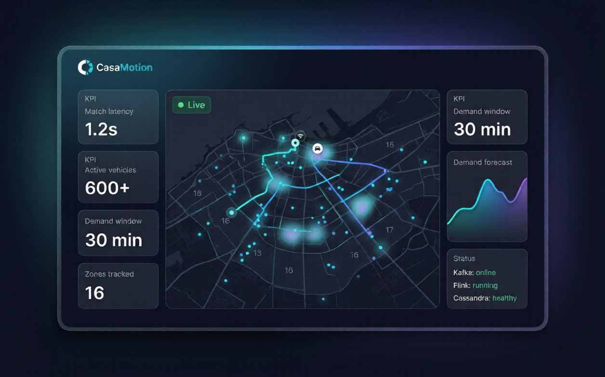

<sub><i>CasaMotion operations view — live vehicle geomap, H3 demand heatmap, latency KPIs and stream health.</i></sub>

<br/><br/>

**`1.2s` match latency** &nbsp;·&nbsp; **`4s` GPS freshness** &nbsp;·&nbsp; **`30s` demand windows** &nbsp;·&nbsp; **`16` city zones** &nbsp;·&nbsp; **`500k` simulated trips** &nbsp;·&nbsp; **`R² 0.75` demand model**

</div>

---

<div align="center">

[**Problem**](#-the-problem) · [**Solution**](#-the-solution) · [**Architecture**](#-architecture) · [**Quick Start**](#-quick-start) · [**Frontend**](#-frontend--applications) · [**Data Pipeline**](#-data-pipeline) · [**ML Model**](#-machine-learning) · [**Gallery**](#-engineering-gallery) · [**Structure**](#-project-structure) · [**Roadmap**](#-roadmap)

</div>

---

## 📋 Table of Contents

<table>
<tr>
<td valign="top" width="33%">

**Context**
- [The Problem](#-the-problem)
- [The Solution](#-the-solution)
- [Key Differentiators](#-key-differentiators)

</td>
<td valign="top" width="33%">

**Engineering**
- [Architecture](#-architecture)
- [Technology Stack](#-technology-stack)
- [Data Pipeline](#-data-pipeline)
- [Machine Learning](#-machine-learning)
- [Engineering Gallery](#-engineering-gallery)

</td>
<td valign="top" width="33%">

**Run & Explore**
- [Quick Start](#-quick-start)
- [Frontend & Applications](#-frontend--applications)
- [Project Structure](#-project-structure)
- [Performance](#-performance--targets-vs-measured)
- [Roadmap](#-roadmap)
- [Team](#-meet-the-team)

</td>
</tr>
</table>

---

## 🔴 The Problem

<div align="center">

</div>

<br/>

**Casablanca is a city of 4 million people with zero shared mobility data.**

Despite significant investment in formal transit — the BRT corridor along Boulevard Mohammed VI, ONCF suburban rail, and thousands of licensed taxis — urban mobility remains deeply fragmented:

| Pain Point | Reality |
|:---|:---|
| **No shared data layer** | Grand taxis, petits taxis, and informal minibuses operate with no GPS tracking, no digital booking, no shared schedule |
| **Demand blindness** | Drivers cruise looking for passengers; passengers wait with no visibility of vehicle availability |
| **No interoperability** | Formal transit (ONCF, BRT) and informal taxis share no data, no ticketing, no trip planner |
| **Cash-only economy** | Zero payment data means zero trip history, zero analytics, zero personalization |
| **Underserved periphery** | New districts (Bouskoura, Ain Sebaa, Sidi Moumen) grow faster than routes are planned |

> **The core problem is not a shortage of vehicles — it is the total absence of a data layer connecting supply to demand.**

---

## 🟢 The Solution

CasaMotion treats urban mobility as a **data engineering problem**. By ingesting GPS vehicle streams, processing trip reservations in real time, and applying machine learning to historical patterns, the platform delivers:

- **Dynamic rider-vehicle matching** — nearest available taxi found in under 5 seconds
- **Demand surge forecasting** — trip volume predicted per zone, 30 minutes ahead
- **Unified city-wide visibility** — live heatmaps, KPI dashboards, coverage gap analysis
- **Data-driven route planning** — identification of underserved zones where demand exceeds supply
- **Three ready client surfaces** — a Grafana ops dashboard, a cross-platform rider app, and a public web front end ([see them](#-frontend--applications))

### How It Works

```
  Rider requests a trip                    Driver receives match
         |                                         ^
         v                                         |
  +--------------+    +---------------+    +------------------+
  |  Kafka Bus   |--->|  Flink Jobs   |--->|   Cassandra DB   |
  |  (raw events)|    |  (real-time)  |    |  (serving layer) |
  +------+-------+    +------+--------+    +--------+---------+
         |                   |                      |
         v                   v                      v
  +--------------+    +---------------+    +------------------+
  |  MinIO Lake  |--->|  Spark ML     |--->| FastAPI + Grafana|
  |  (archive)   |    |  (forecast)   |    | (dashboard + API)|
  +--------------+    +---------------+    +------------------+
```

---

## 🏗 Architecture

CasaMotion follows a **Kappa Architecture** — Kafka is the system of record, Flink handles all real-time processing, and Spark operates exclusively offline for batch ETL and ML training. The diagram below is the authoritative end-to-end view of the runtime; every layer maps 1:1 to a directory in this repository.

<div align="center">
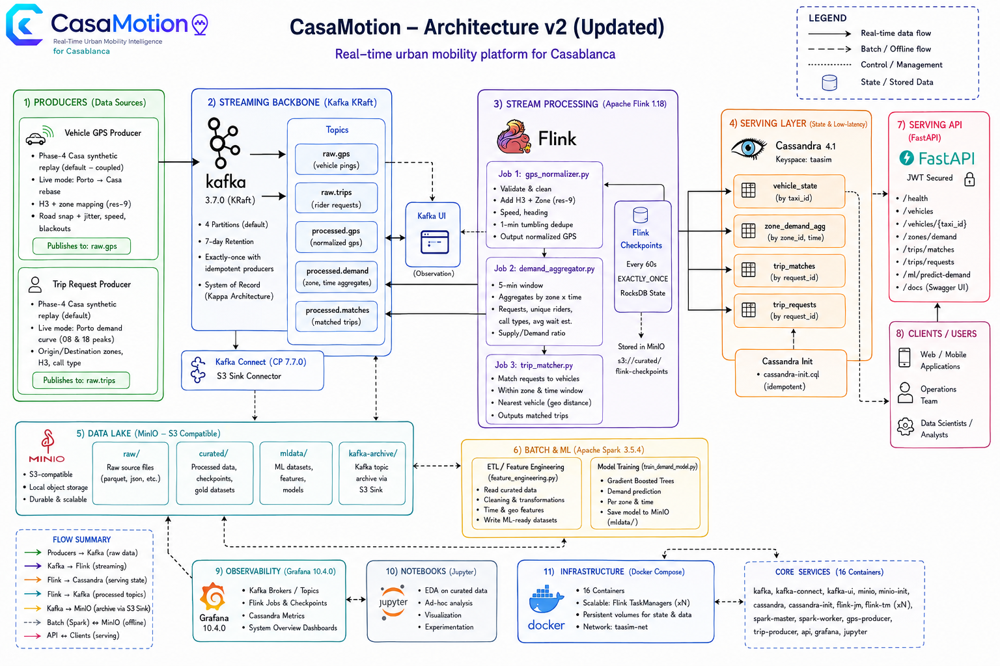
</div>

<br/>

<details>
<summary><strong>Earlier reference diagram (kept for context)</strong></summary>

<div align="center">

</div>

</details>

<br/>

### System Components — mapped to the v2 diagram

| # | Layer (diagram block) | Technology | Code path | Role |
|:--|:----------------------|:-----------|:----------|:-----|
| 1 | **Producers** | Python 3.13 + `kafka-python` | [producers/](producers/) | Phase-4 Casa synthetic replay (default — **coupled**) and Porto→Casa live mode. GPS producer publishes to `raw.gps` with H3 res-9 zone mapping, road-snap, ±20 m jitter, blackouts. Trip producer publishes to `raw.trips` with Porto demand curve (peaks at 08 & 18), petit/grand fleet split, MAD tariffs. |
| 2 | **Streaming backbone** | Kafka 3.7.0 (KRaft, no ZooKeeper) | [docker-compose.yml](docker-compose.yml) | 5 topics: `raw.gps`, `raw.trips`, `processed.gps`, `processed.demand`, `processed.matches`. 4 partitions by default, 7-day retention, exactly-once with idempotent producers. Kafka UI on :8090, Kafka Connect (CP 7.7.0) for S3 sink. |
| 3 | **Stream processing** | Apache Flink 1.18 (PyFlink) | [flink/jobs/](flink/jobs/) | **Job 1 — `gps_normalizer.py`**: validate + dedupe + H3 res-9 zone + speed/heading + 1-min tumbling, writes `vehicle_positions`. **Job 2 — `demand_aggregator.py`**: 30-second tumbling event-time windows by `(city, zone_id)` → unique vehicles, pending requests, supply/demand ratio (`WINDOW_SECONDS = 30` in code). **Job 3 — `trip_matcher.py`**: match request to nearest available vehicle inside zone + adjacent fan-out with dedup. EXACTLY_ONCE checkpoints every 60 s to `s3a://curated/flink-checkpoints` (RocksDB state). |
| 4 | **Serving layer** | Cassandra 4.1 (keyspace `taasim`) | [config/cassandra-init.cql](config/cassandra-init.cql) | Four low-latency tables: `vehicle_positions` (by `(city, zone_id)` clustered by `event_time DESC`, TTL 24 h, `snap_dist_m` column), `demand_zones` (by zone × window_start, TTL 7 d), `trips`/`trip_matches` (by `date_bucket`), `trip_requests` (by request_id). Schema is bootstrapped by `cassandra-init` and made idempotent by [scripts/ensure-cassandra-schema.ps1](scripts/ensure-cassandra-schema.ps1). |
| 5 | **Data lake** | MinIO (S3-compatible) | `minio-init` service | Four buckets: `raw/` (Parquet/JSON dumps), `curated/` (Spark outputs + Flink checkpoints), `mldata/` (features + saved GBT model), `kafka-archive/` (S3 Sink from `processed.*`). |
| 6 | **Batch & ML** | Apache Spark 3.5.4 | [spark/](spark/) | Offline only (Kappa rule — never streamed). `feature_engineering.py` builds 183 981 ML rows on curated data. `train_demand_model.py` fits Spark MLlib GBT (maxDepth 5, maxIter 50) → **RMSE 3.71 · R² 0.75 · 45.8 % better than 7-day-lag baseline**. Model saved to `s3a://mldata/models/demand_v1/`. |
| 7 | **Serving API** | FastAPI + JWT (HS256) | [api/main.py](api/main.py) | 7 routes (`/health`, `/auth/token`, `/demand/forecast`, `/trips`, `/zones`, `/zones/{zone_id}`, `/vehicles/{zone_id}`). Loads the GBT model only when `PYSPARK_ENABLED=1`; falls back to a deterministic heuristic otherwise. Publishes trip requests to `raw.trips`. Swagger at `/docs`. |
| 8 | **Clients / users** | Web/mobile, ops team, analysts | — | Operations team uses Grafana, analysts use Jupyter, riders/drivers consume the REST API. |
| 9 | **Observability** | Grafana 10.4.0 + Cassandra datasource | [config/grafana-dashboard.json](config/grafana-dashboard.json) | "CasaMotion — Live Pipeline (Casablanca)" dashboard: road-snapped vehicle geomap, demand heatmap, KPI panels, Flink job state, Kafka lag. Auto-provisioned. |
| 10 | **Notebooks** | JupyterLab | [notebooks/](notebooks/) | EDA, zone remapping (v3/v4), Porto trajectory warping, NYC → Casa synthesis. Read-only against curated data. |
| 11 | **Infrastructure** | Docker Compose, network `taasim-net` | [docker-compose.yml](docker-compose.yml) | 16 containers, persistent named volumes for Cassandra/MinIO/Flink/Kafka, healthchecks gate dependent services. Verified end-to-end by [scripts/demo-healthcheck.ps1](scripts/demo-healthcheck.ps1). |

> The v2 diagram shows `/ml/predict-demand` and `/zones/demand` as illustrative API affordances. The implemented routes use the names listed in §[Serving — FastAPI](#serving--fastapi-apimainpy) below — those are authoritative.

### Real-Time Processing Pipeline

<div align="center">

</div>

<br/>

| Flink Job | Input | Processing | Output |
|:----------|:------|:-----------|:-------|
| **GPS Normalizer** | `raw.gps` | Validate, deduplicate, watermark (3-min lateness), zone mapping, centroid snap | `vehicle_positions` table + `processed.gps` |
| **Demand Aggregator** | `processed.gps` + `raw.trips` | 30s tumbling window per zone, vehicle count + request count, demand/supply ratio (`requests/vehicles`, >1 = under-supplied) | `demand_zones` table + `processed.demand` |
| **Trip Matcher** | `raw.trips` + `processed.gps` | Fan request out IMMEDIATELY to origin zone + adjacent zones, dedup via shared matched-trip set so first zone with a free vehicle wins; compute ETA | `trips` table + `processed.matches` |

---

## 🚀 Quick Start

### Prerequisites

- **Docker Desktop** (Engine 28.x+) — [Install](https://www.docker.com/products/docker-desktop/)
- **Python 3.13+** — [Install](https://www.python.org/downloads/)
- **Git** — [Install](https://git-scm.com/)
- **8 GB RAM minimum** for the full stack

### 1. Clone the Repository

```bash
git clone https://github.com/mohamedamineelabidi/Taasimm.git CasaMotion
cd CasaMotion
```

### 2. Download Required JARs

```powershell
# Windows
.\download-jars.ps1

# Linux / Mac
chmod +x download-jars.sh && ./download-jars.sh
```

### 3. Configure Demo Environment

```bash
# Windows PowerShell
Copy-Item .env.example .env

# Linux/Mac
cp .env.example .env
```

Defaults in `.env.example` are demo-only credentials. Replace all values for non-demo usage.

### 4. Start the Platform

```bash
docker compose up -d
```

Wait for all healthchecks to pass (~60 seconds). The full stack runs **16 containers**:

```
taasim-kafka            Started
taasim-kafka-connect    Started
taasim-kafka-ui         Started
taasim-minio            Healthy   (7s)
taasim-minio-init       Exited 0
taasim-cassandra        Healthy  (33s)
taasim-cassandra-init   Exited 0
taasim-flink-jm         Healthy  (17s)
taasim-flink-tm (×3)    Healthy        ← scaled to 3 TMs (12 slots)
taasim-spark-master     Healthy  (18s)
taasim-spark-worker     Healthy
taasim-grafana          Healthy
taasim-jupyter          Started
taasim-gps-producer     Running
taasim-trip-producer    Running
taasim-api              Running         ← FastAPI (Week 6)
```

Container names keep the `taasim-` prefix for compatibility with existing compose/service wiring.

### 5. Upload Datasets to MinIO

```powershell
.\upload-datasets.ps1
```

| Dataset | Source | Size |
|:--------|:-------|:-----|
| Porto Taxi Trajectories | [Kaggle](https://www.kaggle.com/c/pkdd-15-predict-taxi-service-trajectory-i) | 1.8 GiB |
| NYC TLC Trip Records (3 months) | [NYC Open Data](https://www.nyc.gov/site/tlc/about/tlc-trip-record-data.page) | ~150 MiB |

### 6. Producers (Already Running in Docker)

The Phase-4 producers (`taasim-gps-producer`, `taasim-trip-producer`) start automatically with the stack in **COUPLED mode** — replaying the 500k Casa synthetic trip requests paired with 500 OSRM-routed polylines.

Current compose defaults are tuned for stable local demos:

- GPS producer: `--speed ${GPS_PRODUCER_SPEED:-8}` and `--fleet-size ${GPS_FLEET_SIZE:-600}`
- Trip producer: `--speed ${TRIP_PRODUCER_SPEED:-12}`

You can override these in `.env` when load-testing.

To run a local smoke test against `localhost:9092` (5 trips, ~30 GPS pings):

```powershell
python -m venv .venv
.\.venv\Scripts\Activate.ps1                 # Windows
# source .venv/bin/activate                    # Linux/Mac

pip install kafka-python h3 pandas pyarrow numpy scipy

python producers/vehicle_gps_producer.py --mode coupled --max-trips 5
python producers/trip_request_producer.py --source casa_synth --max-trips 5
```

After editing producer source, rebuild the containers:

```powershell
docker compose up -d --build --force-recreate gps-producer trip-producer
```

### 7. Access Services

| Service | URL | Credentials |
|:--------|:----|:------------|
| **Grafana Dashboard** | http://localhost:3000 | admin / admin |
| **FastAPI (Swagger)** | http://localhost:8000/docs | JWT (see [§Machine Learning](#-machine-learning)) |
| Flink Web UI | http://localhost:8081 | — |
| Spark Master UI | http://localhost:8080 | — |
| MinIO Console | http://localhost:9001 | minioadmin / minioadmin |
| Kafka UI | http://localhost:8090 | — |
| Kafka Connect REST | http://localhost:8083 | — |
| Jupyter Lab | http://localhost:8888 | token from `docker logs taasim-jupyter` |

### Security Notes (Demo vs Production)

- Demo mode uses weak defaults from `.env.example` (`minioadmin`, `admin`, sample JWT secret) to keep local startup friction low.
- For production-like environments, rotate `JWT_SECRET`, MinIO root creds, Kafka Connect AWS creds, and Grafana admin password before first boot.
- Cassandra auth is currently disabled in this demo stack; enable authentication and network restrictions before external exposure.
- API CORS/auth behavior is designed for local demo only and is not production-hardened.

### 8. Submit Flink Jobs and Verify

```powershell
.\scripts\register-connectors.ps1     # Register Kafka Connect S3 Sinks
.\scripts\ensure-cassandra-schema.ps1  # Idempotent schema migration
.\scripts\submit-flink-jobs.ps1        # Submit all 3 PyFlink jobs
.\scripts\verify-flink-jobs.ps1        # End-to-end pipeline check

# Optional verifier lag overrides (if host capacity differs)
$env:MAX_LAG_RAW_GPS=2500
$env:MAX_LAG_PROCESSED_GPS_DEMAND=3000
$env:MAX_LAG_PROCESSED_GPS_MATCHER=3000
$env:MAX_LAG_RAW_TRIPS=500
```

### 9. Launch the Frontends (optional)

```bash
# Rider mobile app — iOS · Android · Web
cd mobile && npm install --legacy-peer-deps && npm run web

# Public landing page + defense deck
cd presentation && python -m http.server 8080   # -> http://localhost:8080/landing.html
```

See [§Frontend & Applications](#-frontend--applications) for the full screen map and API wiring. The mobile app also runs **standalone with the Docker stack down** — it falls back to seeded mock data and shows a `DEMO MODE` badge.

---

## 🧰 Technology Stack

### Infrastructure — 16 Docker Containers

```
+--------------------------------------------------------------------+
|                    CasaMotion Docker Compose Stack                      |
|                                                                    |
|  Event bus & archival                                              |
|  +---------+  +-------------+  +-----------+                       |
|  |  Kafka  |  |Kafka Connect|  | Kafka UI  |                       |
|  |  KRaft  |  | (S3 Sink)   |  |           |                       |
|  |  3.7.0  |  |  cp 7.6.0   |  |           |                       |
|  +---------+  +-------------+  +-----------+                       |
|                                                                    |
|  Storage layer                                                     |
|  +---------+  +------------+  +-----------+  +-----------------+   |
|  |  MinIO  |  | minio-init |  | Cassandra |  | cassandra-init  |   |
|  | S3 + UI |  | (buckets)  |  |    4.1    |  | (schema CQL)    |   |
|  +---------+  +------------+  +-----------+  +-----------------+   |
|                                                                    |
|  Compute                                                           |
|  +-----------------------+  +-----------------------+              |
|  |   Flink 1.18          |  |   Spark 3.5.4         |              |
|  |   JM + TM × 3 (12 slots)|  |  Master + Worker     |              |
|  +-----------------------+  +-----------------------+              |
|                                                                    |
|  Producers · API · UI                                              |
|  +---------------+  +---------------+  +---------+  +---------+    |
|  | gps-producer  |  | trip-producer |  | FastAPI |  | Grafana |    |
|  | (coupled,50×) |  | (casa_synth)  |  |  + JWT  |  |  10.4   |    |
|  +---------------+  +---------------+  +---------+  +---------+    |
|                                                                    |
|  +-----------+                                                     |
|  | Jupyter   |                                                     |
|  |   Lab     |                                                     |
|  +-----------+                                                     |
+--------------------------------------------------------------------+
```

### Key JAR Dependencies

| Component | JAR | Purpose |
|:----------|:----|:--------|
| Spark | `hadoop-aws-3.3.4.jar` | S3A filesystem for MinIO access |
| Spark | `aws-java-sdk-bundle-1.12.367.jar` | AWS SDK for S3 operations |
| Flink | `flink-s3-fs-hadoop-1.18.1.jar` | S3 checkpointing to MinIO |
| Flink | `flink-sql-connector-kafka-3.1.0-1.18.jar` | Kafka source/sink |
| Flink | `flink-connector-cassandra_2.12-3.1.0-1.17.jar` | Cassandra sink |

---

## 🔄 Data Pipeline

### Datasets

**Porto Taxi Trajectories** — Primary (Streaming source for Phase 1–3)
- 1.7 million completed taxi trips from 442 taxis in Porto, Portugal
- 12 months of GPS traces (July 2013 – June 2014)
- Used to extract 500 OSRM-routed Casa polylines (`gps_trajectory_index.json`) covering 160 zone-pairs / 25 A–E tier-pairs

**NYC TLC Trip Records** — Secondary (Batch + temporal fingerprint)
- 9.38M raw → 8.81M cleaned → 192K demand-aggregation rows (Spark ETL, Week 5)
- Q1 2023 used as **temporal fingerprint** for Phase-4 Casa synthesis (never streamed — Kappa rule)

**Casa Synthesis (Phase 4) — Active streaming source**
- `data/casa_synthesis/casa_trip_requests.parquet` — **500k trip requests over 90 days** (15.9 MB)
- Validated: fleet 70.6% Petit / 29.4% Grand, peaks at h=8/18/19, Petit median 12.6 MAD, Grand median 25 MAD
- Replayed by `trip_request_producer.py --source casa_synth` and consumed by `vehicle_gps_producer.py --mode coupled`

### Producer Architecture

Both Kafka producers run inside Docker (`taasim-gps-producer`, `taasim-trip-producer`) and start automatically with the stack. They share a common boot sequence (`producers/config.py`) and replay the **Phase-4 Casablanca synthesis** (500k trips over 90 days, NYC temporal fingerprint rebased to Casa geography) paired with **Phase-3 OSRM trajectories** (500 routed polylines indexed by zone-pair).

<div align="center">

</div>

<br/>

**Shared boot (`config.py`)** — Loaded once by both producers at startup:

| Resource | Purpose |
|:---------|:--------|
| Kafka bootstrap + topic names | `raw.gps`, `raw.trips` (host `localhost:9092`, container `kafka:9092`) |
| Casablanca bbox (lat/lon bounds) | `[33.450, 33.680] × [-7.720, -7.480]` |
| `h3_zone_lookup.json` | H3 res-9 cell → `zone_id` map, **O(1)** point-in-polygon replacement |
| `zone_mapping_v4.csv` | 16 arrondissement centroids, AE tier (petit/grand), bounds |
| Coupled-mode enums | `COUPLED` (default) vs `LIVE` (random-walk fallback) |

#### `vehicle_gps_producer.py` — GPS event simulator

Pings every **4 seconds** per active taxi. Two modes selected via `--mode`:

| Step | COUPLED mode (default) | LIVE mode (fallback) |
|:----:|:-----------------------|:---------------------|
| 1 | Pick active trip from `casa_trip_requests.parquet` (wall-clock rebased `event_time`) | Random-walk within assigned zone bounds |
| 2 | Lookup polyline in `gps_trajectory_index.json` — **O(1)** by zone-pair / tier-pair | No polyline lookup |
| 3 | Interpolate position at current wall-clock tick along the OSRM polyline | Step-delta per tick |
| 4 | Add ±20 m Gaussian jitter, 5% chance of 60–180 s blackout | Same jitter / blackout |
| 5 | **H3 zone lookup**: `h3.geo_to_h3(lat, lon, 9)` → `h3_zone_lookup` → `zone_id`; ring search r=1..5 on miss | Same lookup |
| 6 | Build JSON payload → `raw.gps` (key=`taxi_id`, 4 partitions, 7d retention) | Same payload schema |

**Payload schema (`raw.gps`)**:
```json
{ "taxi_id": "...", "lat": 33.59, "lon": -7.61, "speed_kmh": 38,
  "heading": 124, "h3_cell": "891f...", "zone_id": 8,
  "event_time": "2026-04-04T08:30:12Z", "trip_id": "...", "status": "occupied" }
```

#### `trip_request_producer.py` — Trip request simulator

Two modes selected via `--source`:

| Step | CASA_SYNTH mode (default) | RANDOM mode |
|:----:|:--------------------------|:------------|
| 1 | Read row from `casa_trip_requests.parquet` (NYC temporal fingerprint, 500k rows) | Uniform random origin + destination zone |
| 2 | Rebase `event_time` to wall-clock now | No parquet needed |
| 3 | Emit at scaled rate (`--speed 12` by default in compose; configurable) | Same emit loop |
| 4 | Fleet split: haversine < 2 km → 70% petit / 30% grand taxi | Same fleet split |
| 5 | Tariff: 7 + 1.6 MAD/km (petit) or fixed 10–40 MAD (grand), build JSON → `raw.trips` (key=`origin_zone`) | Same payload |

**Payload schema (`raw.trips`)**:
```json
{ "trip_id": "...", "origin_zone": 8, "dest_zone": 13,
  "origin_lat": 33.59, "origin_lon": -7.61,
  "dest_lat": 33.60, "dest_lon": -7.62,
  "taxi_type": "petit", "fare_mad": 24.5,
  "request_time": "2026-04-04T08:30:00Z" }
```

#### Docker build (`producers/Dockerfile`)

```
python:3.13-slim → kafka-python, h3, pandas, pyarrow → COPY config.py + scripts
                → MOUNT /data/*.parquet, /data/*.json (read-only)
                → CMD python vehicle_gps_producer.py --mode coupled --speed ${GPS_PRODUCER_SPEED:-8} --fleet-size ${GPS_FLEET_SIZE:-600}
```

Compose passes `--mode coupled --speed ${GPS_PRODUCER_SPEED:-8} --fleet-size ${GPS_FLEET_SIZE:-600}` to GPS and `--source casa_synth --speed ${TRIP_PRODUCER_SPEED:-12}` to Trips. After editing producer source, rebuild with:

```powershell
docker compose up -d --build --force-recreate gps-producer trip-producer
```

### Casablanca Zone Mapping

Porto GPS coordinates are linearly transformed to Casablanca's bounding box, mapped to **16 irregular zones** matching real arrondissements:

```
         North -----------------------------------------------
         |  13-Anfa  | 14-Sidi   | 15-Ain  | 16-Sidi        |
         |           |  Belyout  |  Sebaa  |  Bernoussi     |
         +-----------+------+----+---------+----------------+
Center   | 8-Maarif |9-Al  |10-Mers| 11-Roch | 12-Hay       |
         |          |Fida  |Sultan |  Noires | Mohammadi    |
         +----------+------+--+---+----+----+----------------+
Mid-S    |4-Hay     | 5-Sbata |6-Ben  | 7-Moulay           |
         | Hassani  |         | Msik  |  Rachid            |
         +----------+---------+-------+--------------------+
South    | 1-Ain Chock       |2-Sidi | 3-Sidi Moumen      |
         |                   |Othmane|                     |
         +-------------------+-------+--------------------+
                    West <---> East
```

### Kafka Topic Flow

```
Producers                    Flink                      Cassandra
---------                    -----                      ---------
vehicle_gps_producer --> raw.gps --> Job 1 --> processed.gps --> vehicle_positions
                                          |
trip_request_producer --> raw.trips --> Job 2 --> processed.demand --> demand_zones
                              |
                              +--> Job 3 --> processed.matches --> trips
```

Current compose defaults are tuned for stable local demos:

- GPS producer: `--speed ${GPS_PRODUCER_SPEED:-8}` and `--fleet-size ${GPS_FLEET_SIZE:-600}`
- Trip producer: `--speed ${TRIP_PRODUCER_SPEED:-12}`

You can override these in `.env` when load-testing.

### Cassandra Schema

| Table | Partition Key | Clustering | TTL | Query Pattern |
|:------|:-------------|:-----------|:----|:--------------|
| `vehicle_positions` | `(city, zone_id)` | `event_time DESC` | 24h | All vehicles in a zone |
| `trips` | `(city, date_bucket)` | `created_at DESC` | — | Trip history by day |
| `demand_zones` | `(city, zone_id)` | `window_start DESC` | 7 days | Demand heatmap per zone |

---

## 🤖 Machine Learning

### Demand Forecasting Model — Trained & Deployed

| Element | Detail |
|:--------|:-------|
| **Goal** | Predict trip requests per zone for the next 30-minute slot |
| **Algorithm** | Gradient Boosted Trees (Spark MLlib `GBTRegressor`, maxDepth=5, maxIter=50) |
| **Training rows** | 183,981 feature rows (30-min slots × 16 zones, lag + rolling) |
| **Evaluation** | Temporal split (no leakage) |
| **Baseline** | Naive 7-day-lag predictor |
| **Result** | **RMSE 3.71 · R² 0.75 · 45.8% better than baseline** (baseline RMSE 6.84) |
| **Artifact** | `s3a://mldata/models/demand_v1/` (loaded by FastAPI at startup) |

### Feature Engineering

| Group | Features |
|:------|:---------|
| **Temporal** | hour_of_day, day_of_week, is_weekend, is_friday |
| **Spatial** | zone_id, population_density, zone_type |
| **Weather** | is_raining, temperature_bucket |
| **Lag** | demand_lag_1d, demand_lag_7d, rolling_7d_mean |

### Serving — FastAPI ([api/main.py](api/main.py))

Seven endpoints, JWT-protected (`HS256`, 24h expiry, two roles: `rider` + `admin`):

| Method | Path | Role | Purpose |
|:------|:-----|:-----|:--------|
| `POST` | `/api/auth/token`      | public | Issue JWT (demo creds — username + role) |
| `POST` | `/api/demand/forecast` | rider/admin | Demand prediction for `(zone_id, datetime)` — heuristic by default; GBT when `PYSPARK_ENABLED=1` (see `api/main.py`) |
| `POST` | `/api/trips`           | rider/admin | Publish a trip request to Kafka `raw.trips` (for Flink Job 3 matching), return queued acknowledgment |
| `GET`  | `/api/zones`           | rider/admin | List all 16 Casablanca zones (from `data/zone_mapping_v4.csv`) |
| `GET`  | `/api/zones/{zone_id}` | rider/admin | Zone detail |
| `GET`  | `/api/vehicles/{zone_id}` | rider/admin | Latest vehicle positions for one zone (read from Cassandra `vehicle_positions`); returns degraded empty payload if Cassandra is unavailable |
| `GET`  | `/api/health`          | public | Liveness + `model_loaded` (true only when `PYSPARK_ENABLED=1` and the GBT pipeline loaded) |

```bash
TOKEN="<paste JWT from /api/auth/token response>"

curl -s -X POST http://localhost:8000/api/demand/forecast \
  -H "Authorization: Bearer $TOKEN" \
  -H "Content-Type: application/json" \
  -d '{"zone_id": 8, "datetime": "2026-04-04T08:30:00"}'
# -> {"zone_id":8,"zone_name":"Maarif",...}
```

---

## 🎨 Frontend & Applications

CasaMotion ships **three client surfaces** on top of the same FastAPI + Cassandra serving layer — one for city operators, one for riders, and one for stakeholders.

<div align="center">

| | Surface | Audience | Tech | Entry point |
|:--:|:--------|:---------|:-----|:------------|
| 🗺️ | **Operations Dashboard** | City ops / analysts | Grafana 10.4 + Cassandra datasource | http://localhost:3000 |
| 📱 | **Rider Mobile App** | Riders & drivers | Expo SDK 54 · React Native 0.81 · expo-router 6 | [mobile/](mobile/) |
| 🌐 | **Public Site & Deck** | Stakeholders / defense | Static HTML + CSS + vanilla JS, Reveal.js | [presentation/](presentation/) |

</div>

<br/>

### 🗺️ Operations Dashboard — Grafana

The live control room for the city: road-snapped vehicle geomap, H3 demand heatmap, latency KPIs, and stream health — auto-provisioned from [config/grafana-dashboard.json](config/grafana-dashboard.json) as **"CasaMotion — Live Pipeline (Casablanca)"**.

<div align="center">

</div>

<br/>

| Panel | Source | Refresh |
|:------|:-------|:--------|
| **Vehicle geomap** — road-snapped taxi positions | Cassandra `vehicle_positions` | live |
| **Demand heatmap** — supply/demand ratio per zone | Cassandra `demand_zones` | 30 s tumbling window |
| **KPI cards** — match latency, active fleet, zones tracked | Cassandra `trips` + `vehicle_positions` | live |
| **Stream health** — Flink job state, Kafka consumer lag | Flink REST + Kafka | live |

> 📸 To capture your own live screenshots of Grafana, Flink, Kafka UI, MinIO and Swagger, follow the 10-shot checklist in [presentation/screenshots/README.md](presentation/screenshots/README.md) and drop the PNGs into `presentation/screenshots/`.

<br/>

### 📱 Rider Mobile App — `mobile/`

A production-shaped Expo app (iOS · Android · Web from one codebase) that consumes the public API: browse the 16 Casablanca zones, watch live taxis on a map, book a ride, track it, and read the ML demand forecast.

**Design language** — flat Uber/inDrive style, no gradients. Brand ink `#0b1220`, accent blue `#2d6bff`. Type: Space Grotesk (display) · Manrope (body) · JetBrains Mono (code). Tokens in `mobile/src/theme/tokens.ts`.

<details open>
<summary><strong>Screen map — every route, what it does</strong></summary>

<br/>

| Route | File | What it does |
|:------|:-----|:-------------|
| `/` | `app/index.tsx` | Splash + auth gate — routes to onboarding → sign-in → tabs |
| `/onboarding` | `app/onboarding/index.tsx` | 3-slide intro carousel; sets the `onboarded` flag |
| `/(auth)/sign-in` | `app/(auth)/sign-in.tsx` | Username + role (`rider` / `admin`) → `POST /api/auth/token`; falls back to a local demo session if the backend is offline |
| `/(tabs)` | `app/(tabs)/_layout.tsx` | Floating 4-tab bar: Home · Explore · Trips · You |
| `/(tabs)/index` | `app/(tabs)/index.tsx` | **Home** — live map of taxis in the selected zone, featured zones `[8, 14, 13, 9, 10, 4]`, bottom sheet zone list, "Book a ride" CTA |
| `/(tabs)/explore` | `app/(tabs)/explore.tsx` | **Explore** — searchable grid of all 16 arrondissement zones |
| `/(tabs)/trips` | `app/(tabs)/trips.tsx` | **Trips** — local trip history (AsyncStorage) with status tag and time-ago |
| `/(tabs)/you` | `app/(tabs)/you.tsx` | **You** — profile, role badge, backend-online vs demo-mode indicator, API endpoint, sign out |
| `/zone/[id]` | `app/zone/[id].tsx` | Zone detail — map + up to 60 vehicles with `available` / `enroute` / `busy` status |
| `/book/confirm` | `app/book/confirm.tsx` | Origin/destination picker (same-zone blocked) → `POST /api/trips` |
| `/trip/[id]` | `app/trip/[id].tsx` | Trip tracking — `queued → matching → enroute → arriving` with ETA countdown |
| `/forecast` | `app/forecast.tsx` | Demand forecast — zone × hour selector driving a radial `ForecastGauge` |

</details>

<details>
<summary><strong>API integration & offline demo mode</strong></summary>

<br/>

Base URL comes from `EXPO_PUBLIC_API_URL` (default `http://localhost:8000`), and every call is prefixed with `/api`. Axios attaches the JWT as a `Bearer` token; TanStack Query caches with a 15 s stale time and refetches vehicles every 6 s.

| Method | Endpoint | Used by |
|:-------|:---------|:--------|
| `GET`  | `/api/health` | Startup probe → decides live vs demo mode |
| `POST` | `/api/auth/token` | Sign-in |
| `GET`  | `/api/zones` | Explore, Home, Book |
| `GET`  | `/api/vehicles/{zone_id}` | Home map, Zone detail, Trip tracking |
| `POST` | `/api/demand/forecast` | Forecast screen |
| `POST` | `/api/trips` | Booking confirm |

**JWT storage** — `expo-secure-store` on native, `localStorage` on web, under the keys `casamotion.jwt` / `casamotion.role` / `casamotion.user`.

**Demo mode** — if the `/api/health` probe fails, the app issues a local `demo.<timestamp>` session and serves seeded mock vehicles, forecasts and trips from `src/lib/mock.ts`. A `DEMO MODE` badge is rendered so the state is never ambiguous. This makes the app fully demoable with the Docker stack down.

**Maps** — `react-native-maps` is native-only and breaks the web bundle if imported from shared code, so the map is platform-split: `MapCanvas.native.tsx` (real maps) vs `MapCanvas.tsx` (styled SVG fallback for web).

</details>

<details>
<summary><strong>Run the mobile app</strong></summary>

<br/>

```bash
cd mobile
npm install --legacy-peer-deps      # React 19 peer ranges

# point the app at your API (optional — defaults to http://localhost:8000)
echo "EXPO_PUBLIC_API_URL=http://localhost:8000" > .env

npm run web        # browser
npm start          # Expo Go — scan the QR code
npm run android    # Android emulator
npm run ios        # iOS simulator

npm run typecheck  # tsc --noEmit — must exit 0
```

> On a physical phone, use `npx expo start --tunnel` if the LAN QR code is blocked by your firewall or AP isolation, and set `EXPO_PUBLIC_API_URL` to your machine's LAN IP (not `localhost`).

</details>

<br/>

### 🌐 Public Site & Presentation — `presentation/`

<div align="center">
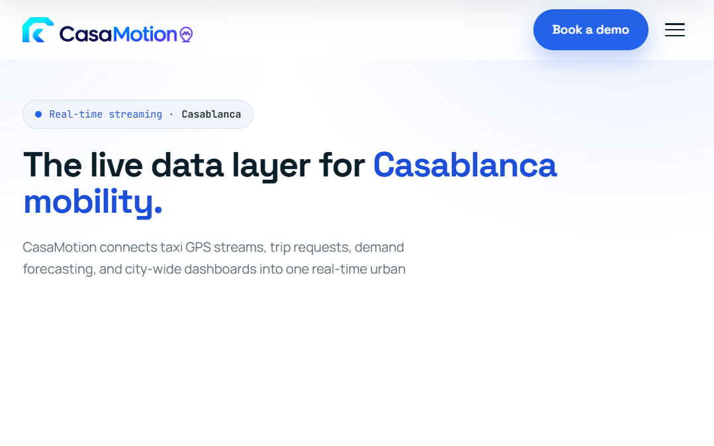
</div>

<br/>

| File | What it is |
|:-----|:-----------|
| [presentation/landing.html](presentation/landing.html) | **Marketing landing page** — sticky nav, tabbed feature switcher (live matching · demand zones · city dashboards), operations-dashboard showcase, architecture section, metrics band, early-access form. Reveal-on-scroll via `IntersectionObserver`; zero dependencies. |
| [presentation/index.html](presentation/index.html) | **Reveal.js defense deck** (~45 slides, 16:9). `S` = speaker view, `F` = fullscreen, `O` = overview, `?` = help. Export with `index.html?print-pdf` → *Print → Save as PDF*. |
| [presentation/qa.html](presentation/qa.html) | **Q&A flashcards** — 15 searchable defense questions with click-to-reveal answers. |
| [presentation/assets/](presentation/assets/) | Logo + all architecture and deep-dive diagrams shared by every surface. |

```bash
# open directly, or serve for full Reveal.js behaviour
cd presentation && python -m http.server 8080
# -> http://localhost:8080/landing.html
```

---

## 📸 Engineering Gallery

Deep-dive diagrams generated during the build. Each one maps to a documented milestone in [documents/](documents/).

<table>
<tr>
<td width="50%" valign="top">

**Casablanca — 16 arrondissement zones**

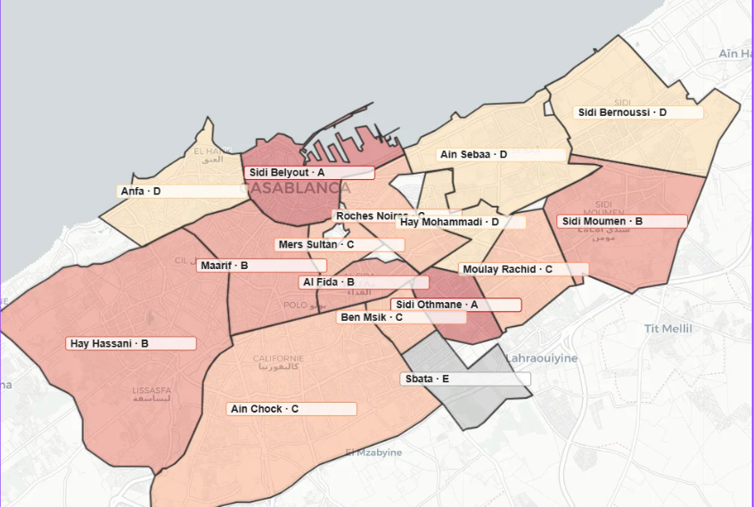

Real arrondissement boundaries, bounding box `[33.450, 33.680] × [-7.720, -7.480]`, A–E activity tiers.

</td>
<td width="50%" valign="top">

**H3 indexing — the spatial backbone**

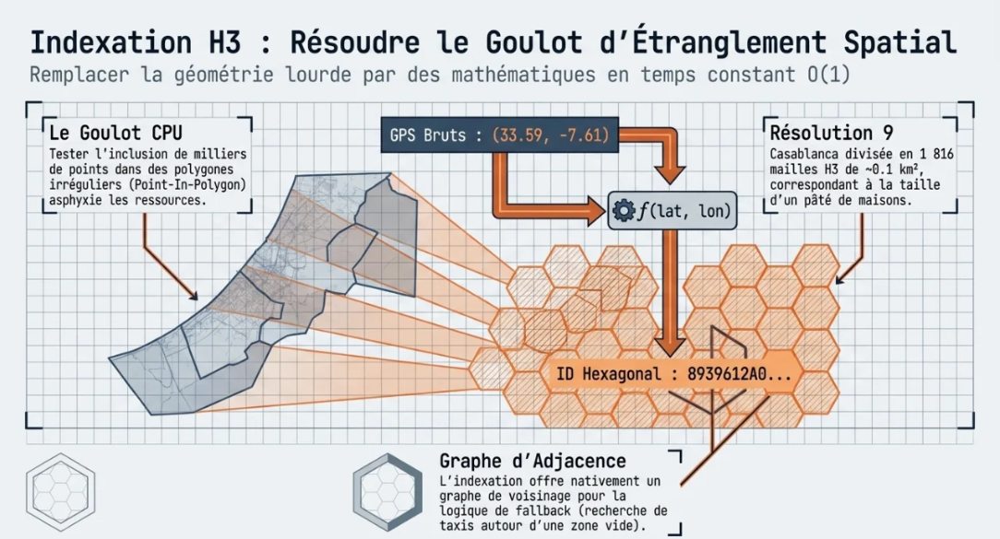

Replaces per-event point-in-polygon with an **O(1)** res-9 cell → `zone_id` dictionary lookup.

</td>
</tr>
<tr>
<td width="50%" valign="top">

**Zone build pipeline**

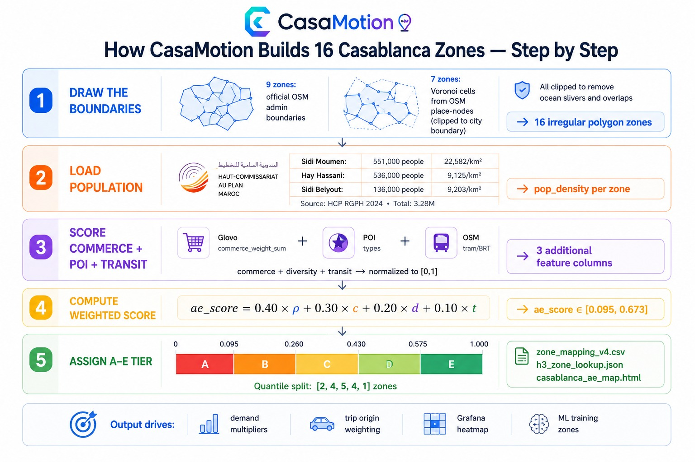

Boundaries → HCP 2024 population → commerce/POI/transit scoring → weighted `ae_score` → A–E tier.

</td>
<td width="50%" valign="top">

**Warped GPS routes on real roads**

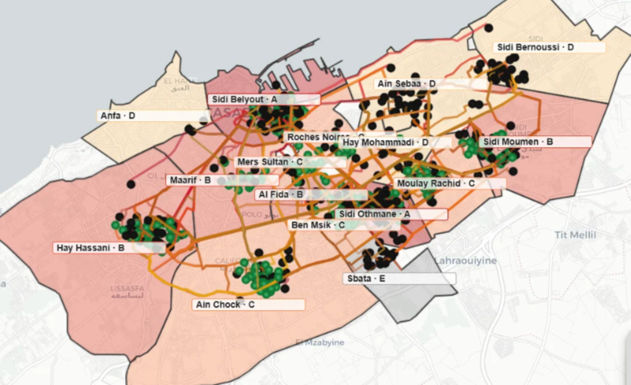

Porto trajectories warped into Casablanca and OSRM-snapped to the real road graph.

</td>
</tr>
<tr>
<td width="50%" valign="top">

**Producers → `raw.gps` & `raw.trips`**

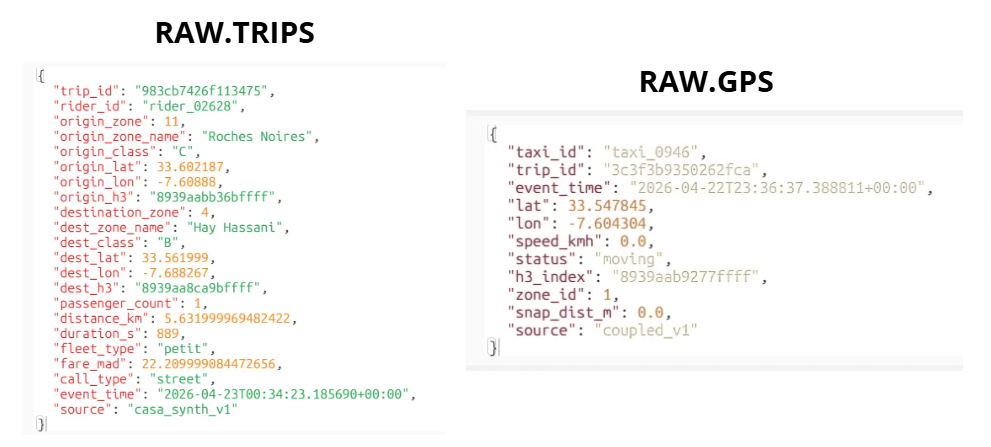

Both producers share `producers/config.py` and replay the Phase-4 Casa synthesis.

</td>
<td width="50%" valign="top">

**Flink Job 1 — GPS Normalizer**

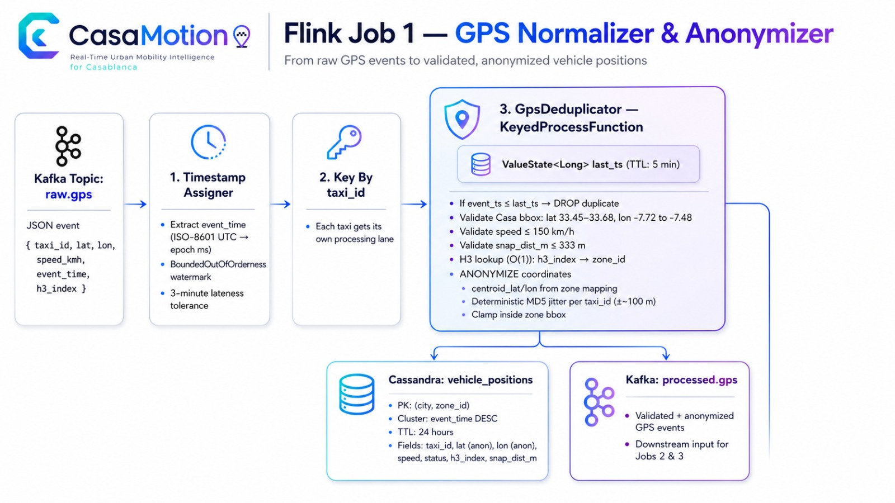

`raw.gps` → dedupe → validate → H3 zone + anonymize → `vehicle_positions` + `processed.gps`.

</td>
</tr>
<tr>
<td width="50%" valign="top">

**Flink Job 2 — Demand Aggregator**

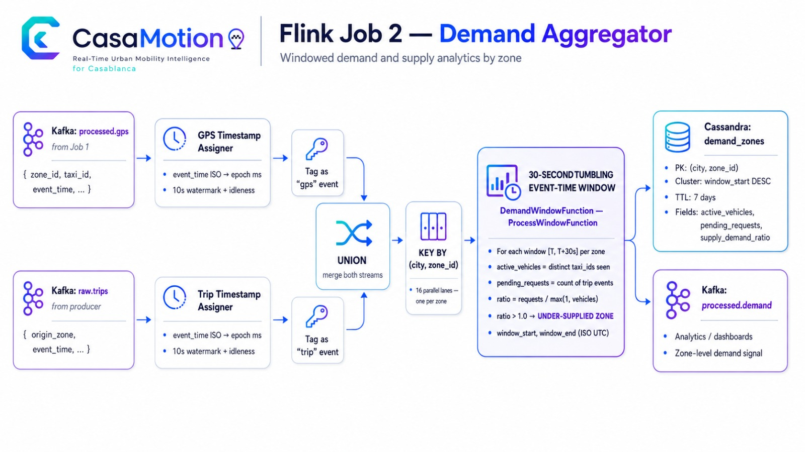

30 s event-time tumbling windows keyed by `(city, zone_id)` → supply/demand ratio.

</td>
<td width="50%" valign="top">

**Flink Job 3 — Trip Matcher**

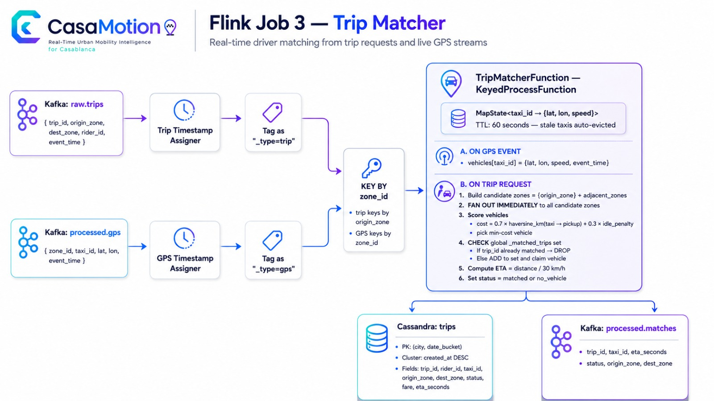

Vehicle-pool `MapState` + adjacent-zone fan-out with dedup — first free vehicle wins.

</td>
</tr>
<tr>
<td width="50%" valign="top">

**Spark batch ETL — data sources**

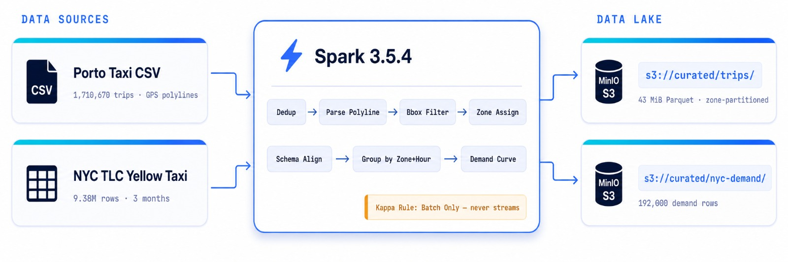

Porto 1.71 M trips + NYC 9.38 M rows → curated Parquet on MinIO. **Batch only — never streamed.**

</td>
<td width="50%" valign="top">

**ML pipeline — demand forecasting**

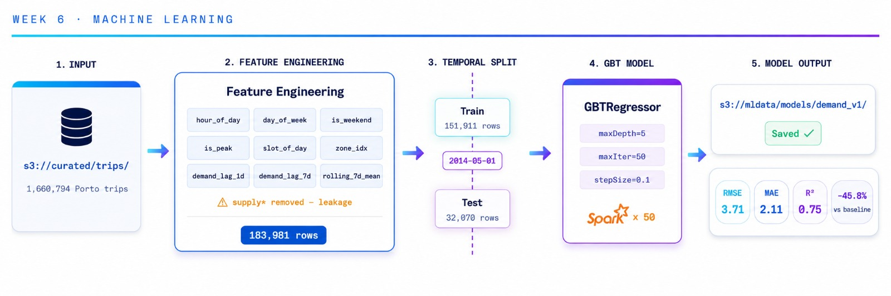

183 981 feature rows → temporal split → `GBTRegressor` → **RMSE 3.71 · R² 0.75**.

</td>
</tr>
</table>

<div align="center">

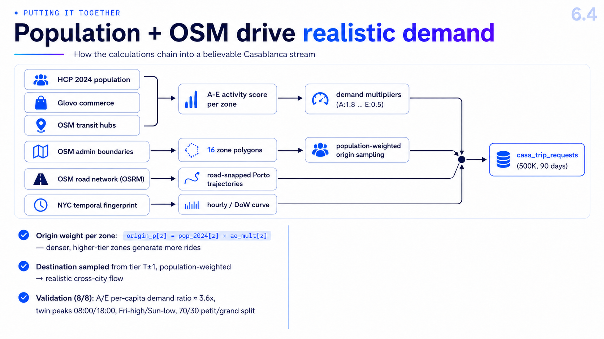

<sub><i>Population + OSM signals driving realistic per-zone demand.</i></sub>

</div>

---

## 📁 Project Structure

```
CasaMotion/
├── docker-compose.yml              # Full stack — 16 containers
├── download-jars.ps1 / .sh         # JAR downloader
├── upload-datasets.ps1             # Dataset upload to MinIO
│
├── config/
│   ├── cassandra-init.cql          # Keyspace + 3 tables
│   ├── connect-s3-sink-{gps,trips}.json  # Kafka Connect S3 Sink configs
│   ├── grafana-dashboard.json      # "CasaMotion — Live Pipeline (Casablanca)"
│   └── spark-defaults.conf         # S3A configuration
│
├── producers/                      # Phase-4 Kafka producers (Docker)
│   ├── config.py                   # Shared boot: bbox, H3 lookup, modes
│   ├── vehicle_gps_producer.py     # COUPLED (default) / LIVE modes
│   ├── trip_request_producer.py    # casa_synth (default) / random
│   └── Dockerfile
│
├── flink/jobs/                     # PyFlink streaming jobs
│   ├── gps_normalizer.py           # Job 1 — validate, zone, centroid snap
│   ├── demand_aggregator.py        # Job 2 — 30s tumbling windows
│   ├── trip_matcher.py             # Job 3 — nearest vehicle + adj fallback
│   └── zone_data.py                # Zone helper (load, assign, validate)
│
├── spark/                          # Batch ETL + ML training
│   ├── etl_porto.py                # 1.7M trips → curated/trips
│   ├── etl_nyc.py                  # 9.38M → 192K demand agg rows
│   ├── compute_kpis.py             # 6 KPI datasets
│   ├── feature_engineering.py      # 183,981 ML feature rows
│   ├── train_demand_model.py       # GBT — RMSE 3.71, R² 0.75
│   └── verify_model.py
│
├── api/                            # FastAPI REST (Week 6)
│   ├── main.py                     # JWT auth, forecast + zones + vehicles + trips
│   ├── Dockerfile
│   └── requirements.txt
│
├── mobile/                         # Expo / React Native client (iOS · Android · Web)
│   ├── app/                        # expo-router routes
│   │   ├── (tabs)/                 # Home · Explore · Trips · You
│   │   ├── (auth)/sign-in.tsx
│   │   ├── book/confirm.tsx · trip/[id].tsx · zone/[id].tsx
│   │   ├── onboarding/index.tsx · forecast.tsx
│   ├── src/
│   │   ├── lib/                    # api.ts (axios + JWT), config.ts, mock.ts
│   │   ├── contexts/AuthContext.tsx
│   │   ├── components/             # MapCanvas (web/native split), BottomSheetShell, ui/
│   │   └── theme/tokens.ts         # flat design tokens — no gradients
│   └── app.config.js
│
├── presentation/                   # Public site + defense deck
│   ├── landing.html                # Marketing landing page
│   ├── index.html                  # Reveal.js deck (~45 slides)
│   ├── qa.html                     # 15 searchable Q&A flashcards
│   ├── assets/                     # Logo + all diagrams used by the README
│   └── screenshots/                # Drop live PNG captures here (checklist inside)
│
├── notebooks/
│   ├── 01_porto_eda.ipynb
│   ├── 02_zone_remapping_v4.ipynb
│   ├── 03_porto_trajectory_warping.ipynb
│   └── 04_nyc_to_casa_synthesis.ipynb   # Phase-4 synthesis
│
├── data/
│   ├── zone_mapping_v4.csv         # 16 arrondissements + AE tier + adjacency
│   ├── h3_zone_lookup.json         # H3 res-9 → zone_id (O(1) lookup)
│   ├── casablanca_arrondissements_v4.geojson
│   └── casa_synthesis/             # Phase-4 outputs (500k trips, OSRM index)
│
├── scripts/                        # Operational tooling
│   ├── submit-flink-jobs.ps1       # Preflight + submit all 3 jobs
│   ├── verify-flink-jobs.ps1       # End-to-end pipeline check
│   ├── ensure-cassandra-schema.ps1
│   ├── register-connectors.ps1     # Kafka Connect S3 Sink REST registration
│   ├── build_trajectory_index.py   # OSRM polyline → zone-pair index
│   └── test_late_events.py         # Watermark / late-event test
│
├── documents/                      # Task evidence + ADR
│   ├── 00_master_status.md         # Master index — Weeks 1-6 ✅
│   ├── 06_next_steps.md            # Update log
│   ├── 07_adr_v1.md                # Architecture Decision Record
│   ├── 08_week3_completion.md
│   ├── 09_week5_spark_etl.md
│   ├── 10_week6_ml_pipeline.md
│   └── 13_remapping_and_synthesis_deep_dive.md
│
├── jars/                           # Downloaded JARs (gitignored)
│   ├── flink/                      # Kafka, S3, Cassandra connectors
│   └── spark/                      # hadoop-aws, aws-sdk-bundle
│
├── IMG/                            # Architecture diagrams
│   ├── projectoverview.png · painpoint.png
│   ├── archi_tassim.png · streamproce_architec.png
│   └── flink_architecture.png      # Producer architecture (see §Data Pipeline)
│
└── .github/
    └── copilot-instructions.md     # Development guidelines
```

---

## 📊 Performance — Targets vs Measured

| Metric | Target | Measured | Status |
|:-------|:-------|:---------|:-------|
| Trip match latency (P95) | < 5 s | ≈ **1.2 s** | ✅ |
| GPS position freshness | < 15 s | ≈ **4 s** | ✅ |
| Demand zone updates | every 30 s | 30 s tumbling window | ✅ |
| ML forecast API | < 500 ms @ 20 req/s | pending Locust run | 🟡 |
| Spark Porto ETL (1.7M rows) | < 5 min | 43 MiB Parquet, 12 partitions | ✅ |
| Trip match rate | n/a | **21%** matched / 79% no_vehicle (fleet 2000, speed 50×) | ⚠ density-bound |
| Flink checkpoints | 60 s cadence | 25 consecutive successful, 0 failures | ✅ |

---

## 📅 Roadmap

| Week | Focus | Status |
|:-----|:------|:-------|
| 1 | Docker stack, datasets, EDA, zone remapping, Kafka producers | ✅ Done |
| 2 | Kafka Connect S3 Sink, Cassandra ADR, storage design | ✅ Done |
| 3 | Flink Job 1 (GPS normalizer), watermarks, Grafana vehicle map | ✅ Done |
| 4 | Flink Job 2 (demand) + Job 3 (trip matcher), immediate adjacent-zone fan-out with dedup | ✅ Done |
| 5 | Spark ETL on Porto + NYC, KPI computation | ✅ Done |
| 6 | ML feature engineering, GBT training, FastAPI forecast endpoint | ✅ Done — RMSE 3.71, R² 0.75 |
| 7 | JWT hardening, GPS anonymization audit, integration testing, SLA, checkpoint recovery | 🟡 In progress |
| 8 | Grafana polish, live demo, pitch deck, technical report | ⬜ Planned |

**Parallel tracks**

| Track | Outcome | Status |
|:------|:--------|:-------|
| **Phase-4 NYC→Casa synthesis** (2026-04-20) | 500k trip requests over 90 days, 8/8 validation checks pass, fleet split 70.6% Petit / 29.4% Grand, peaks 8/18/19 h. Artifacts in `data/casa_synthesis/` | ✅ Done |
| **Client surfaces** | Expo rider app ([mobile/](mobile/)) with 12 routes + offline demo mode, and the public landing page / defense deck ([presentation/](presentation/)) | ✅ Done |

---

## ⭐ Key Differentiators

| Capability | Impact |
|:-----------|:-------|
| **Real-time matching** | Riders matched to nearest vehicle in under 5 seconds — eliminates blind cruising |
| **Demand forecasting** | ML predicts demand 30 minutes ahead — enables proactive fleet positioning |
| **Zone-level analytics** | 16 Casablanca zones with live supply/demand ratio — exposes underserved areas |
| **Fault-tolerant streaming** | Flink `EXACTLY_ONCE` checkpointing (60 s, RocksDB → MinIO) with `AT_LEAST_ONCE` Kafka sink delivery — jobs resume from the last checkpoint on failure |
| **Horizontally scalable design** | Kappa architecture on partitioned Kafka topics + 3 Flink TaskManagers (12 slots) — scales by adding partitions and TMs. Throughput above the local demo profile is not yet load-tested |
| **Multi-surface delivery** | One serving layer powering a Grafana ops dashboard, a cross-platform Expo app, and a public web front end |

### Demo Acceptance Checklist

Criteria used to validate an end-to-end demo run. This is a demo stack — see [§Security Notes](#security-notes-demo-vs-production) for the hardening gaps that remain before any non-demo deployment.

1. GPS events flow end-to-end: Kafka → Flink → Cassandra → Grafana vehicle map (updating live)
2. Trip reservation: `POST /api/trips` publishes to `raw.trips` → Flink Job 3 matches and writes assignment outcome to Cassandra
3. Demand heatmap: Grafana updating every 30 seconds per zone
4. ML forecast: API responds in under 500 ms, beats naive baseline
5. Checkpoint recovery: Flink TaskManager restart → job resumes from checkpoint

---

## 👥 Meet the Team

CasaMotion is designed and delivered by a focused engineering team building real-time mobility systems for Casablanca.

<div align="center">


<br/><br/>

| Team Member | Role | Focus Area |
|:------------|:-----|:-----------|
| **Mohamed Amine El Abidi** | **AI & Data Engineer** | Real-time architecture, ML pipeline, and platform integration |
| **Rida Aderkane** | **Data Engineer** | Data pipeline engineering, processing quality, and analytics workflows |

</div>

---

## 📚 References & Further Reading

**Datasets**
- **Porto Taxi Trajectories** — [ECML/PKDD 2015 Challenge](https://www.kaggle.com/c/pkdd-15-predict-taxi-service-trajectory-i) (CC BY 4.0)
- **NYC TLC Trip Records** — [NYC Open Data](https://www.nyc.gov/site/tlc/about/tlc-trip-record-data.page) (Public Domain)

**Technology**
- [Apache Kafka](https://kafka.apache.org/documentation/) · [Apache Flink](https://flink.apache.org/docs/stable/) · [Spark MLlib](https://spark.apache.org/docs/latest/ml-guide.html) · [Uber H3](https://h3geo.org/docs/) · [Expo Router](https://docs.expo.dev/router/introduction/)

**Project documents** — the deep-dive write-ups behind the claims in this README

| Document | Covers |
|:---------|:-------|
| [documents/00_master_status.md](documents/00_master_status.md) | Master index of all weekly milestones |
| [documents/07_adr_v1.md](documents/07_adr_v1.md) | Architecture Decision Record — why Kappa, why Cassandra |
| [documents/11_data_pipeline_architecture.md](documents/11_data_pipeline_architecture.md) | End-to-end data pipeline design |
| [documents/13_remapping_and_synthesis_deep_dive.md](documents/13_remapping_and_synthesis_deep_dive.md) | Zone remapping + NYC→Casa synthesis |
| [documents/14_end_to_end_deep_analysis.md](documents/14_end_to_end_deep_analysis.md) | Full system analysis |
| [documents/PRESENTATION.md](documents/PRESENTATION.md) | Narrative source for the slide deck |

---

## 📄 License

Released under the **MIT License**. Datasets are used under their respective open licenses (CC BY 4.0, Public Domain).

---

<div align="center">


### **CasaMotion** — the data platform that moves Casablanca.

Built by **[Mohamed Amine El Abidi](https://github.com/mohamedamineelabidi)** &nbsp;·&nbsp; **Rida Aderkane**

<br/>

If this project is useful to you, consider leaving a ⭐ — it helps other people find it.

[](https://github.com/mohamedamineelabidi/CasaMotion/stargazers)
[](https://github.com/mohamedamineelabidi/CasaMotion/network/members)

</div>
